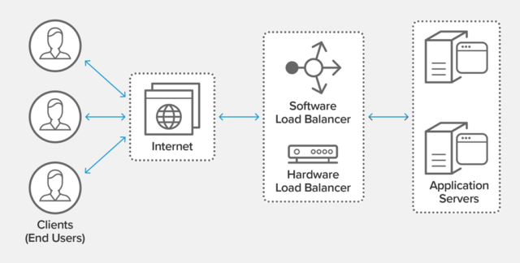

# NGINX Tutorial

### <u>Overview</u>
A Web server is a program that uses HTTP (Hypertext Transfer Protocol) to serve the files that form Web pages to users, in response to their requests.
There are many popular web-servers like Apache, Nginx, IIS. 


> **Performance benefit** Apache uses a process-driven approach and creates a new thread for each request. Whereas NGINX uses an event-driven architecture to handle multiple requests within one thread. Hence NGINX is generally chosen over Apache

Nginx has much more capability than a typical web server. It can act as a reverse proxy, do load-balancing, mail proxy, do HTTP caching.

[]()

### Basic NGINX Configuration Commands:
- nginx -t : Validates nginx configuration
- nginx -s reload : Reloads nginx configuration without restart
- nginx -v : nginx version
- nginx -V : nginx version along with modules

### <u>Proxy</u>

#### Forward Proxy:
A forward proxy, often called a proxy, proxy server, or web proxy, is a server that sits in front of a group of client machines. When those computers make requests to sites and services on the Internet, the proxy server intercepts those requests and then communicates with web servers on behalf of those clients, like a middleman.
For example, let’s name 3 computers involved in a typical forward proxy communication:
- A: This is a user’s home computer 
- B: This is a forward proxy server 
- C: This is a website’s origin server (where the website data is stored) 
  


Why would anyone add this extra middleman to their Internet activity? 

**Ans:** There are a few reasons one might want to use a forward proxy:
- To avoid state or institutional browsing restrictions 
- To block access to certain content
- To protect their identity online


#### Reverse Proxy:
A reverse proxy is a server that sits in front of one or more web servers, intercepting requests from clients. This is different from a forward proxy, where the proxy sits in front of the clients. With a reverse proxy, when clients send requests to the origin server of a website, those requests are intercepted at the network edge by the reverse proxy server. The reverse proxy server will then send requests to and receive responses from the origin server.

The difference between a forward and reverse proxy is subtle but important. A simplified way to sum it up would be to say that a forward proxy sits in front of a client and ensures that no origin server ever communicates directly with that specific client. On the other hand, a reverse proxy sits in front of an origin server and ensures that no client ever communicates directly with that origin server.
<p>Once again, let’s illustrate by naming the computers involved:

- D: Any number of users’ home computers 
- E: This is a reverse proxy server 
- F: One or more origin servers 


**Reverse Proxy Configuration:**
- Reverse Proxy
```sh
nano /etc/nginx/conf.d/proxy.conf
proxy_set_header X-Real-IP $remote_addr;
proxy_set_header Host $host
```
- Backend Server Side
```sh
nano /etc/nginx/nginx.conf
"$http_x_real_ip" 
```


- Sample Configuration on Reverse Proxy Side:
```sh
root@19e3d514c08b:/# cat /etc/nginx/nginx.conf 

user  nginx;
worker_processes  auto;
error_log  /var/log/nginx/error.log notice;
pid        /var/run/nginx.pid;
events {
    worker_connections  1024;
}


http {
    include       /etc/nginx/mime.types;
    default_type  application/octet-stream;

    log_format  main  '$remote_addr - $remote_user [$time_local] "$request" '
                      '$status $body_bytes_sent "$http_referer" '
                      '"$http_user_agent" "$http_x_forwarded_for"';
    access_log  /var/log/nginx/access.log  main;

    sendfile        on;
    #tcp_nopush     on;
    keepalive_timeout  65;
    #gzip  on;

    include /etc/nginx/conf.d/*.conf;
}


root@19e3d514c08b:/# cat /etc/nginx/conf.d/default.conf_backup 
server {
    listen       80;
    listen  [::]:80;
    server_name  localhost;

    #access_log  /var/log/nginx/host.access.log  main;

    location / {
        root   /usr/share/nginx/html;
        # index  index.html index.htm;
        index default.html;
    }
    #error_page  404              /404.html;

    # redirect server error pages to the static page /50x.html
    #
    error_page   500 502 503 504  /50x.html;
    location = /50x.html {
        root   /usr/share/nginx/html;
    }

    # proxy the PHP scripts to Apache listening on 127.0.0.1:80
    #
    #location ~ \.php$ {
    #    proxy_pass   http://127.0.0.1;
    #}

    # pass the PHP scripts to FastCGI server listening on 127.0.0.1:9000
    #
    #location ~ \.php$ {
    #    root           html;
    #    fastcgi_pass   127.0.0.1:9000;
    #    fastcgi_index  index.php;
    #    fastcgi_param  SCRIPT_FILENAME  /scripts$fastcgi_script_name;
    #    include        fastcgi_params;
    #}

    # deny access to .htaccess files, if Apache's document root
    # concurs with nginx's one
    #
    #location ~ /\.ht {
    #    deny  all;
    #}
}

root@19e3d514c08b:/# 
```


### <u>Load Balancer</u>
A load balancer acts as the “traffic cop” sitting in front of your servers and routing client requests across all servers capable of fulfilling those requests in a manner that maximizes speed and capacity utilization and ensures that no one server is overworked, which could degrade performance. If a single server goes down, the load balancer redirects traffic to the remaining online servers. When a new server is added to the server group, the load balancer automatically starts to send requests to it.

In this manner, a load balancer performs the following functions:
- Distributes client requests or network load efficiently across multiple servers
- Ensures high availability and reliability by sending requests only to servers that are online
- Provides the flexibility to add or subtract servers as demand dictates


**Load Balancer Configuration:**
- Sample Configuration on Load Balancer:

```sh
root@01ca1fb01eb0:/# cat /etc/nginx/nginx.conf 

user  nginx;
worker_processes  auto;

error_log  /var/log/nginx/error.log notice;
pid        /var/run/nginx.pid;


events {
    worker_connections  1024;
}


http {
    include       /etc/nginx/mime.types;
    default_type  application/octet-stream;

    log_format  main  '$remote_addr - $remote_user [$time_local] "$request" '
                      '$status $body_bytes_sent "$http_referer" '
                      '"$http_user_agent" "$http_x_forwarded_for"';

    access_log  /var/log/nginx/access.log  main;

    sendfile        on;
    #tcp_nopush     on;

    keepalive_timeout  65;

    #gzip  on;

    include /etc/nginx/conf.d/*.conf;
}


root@01ca1fb01eb0:/# cat /etc/nginx/conf.d/load_balancer.conf 
upstream backend{
    server 172.17.0.2:80 max_fails=2 fail_timeout=30s;
    server 172.17.0.3:80 max_fails=2 fail_timeout=30s weight=2;
    # server 172.17.0.4:80;
}

server {
    listen       80;
    listen  [::]:80;
    server_name  localhost;

    #access_log  /var/log/nginx/host.access.log  main;

    location / {
        # root   /usr/share/nginx/html;
        # index  index.html index.htm;
	    proxy_pass http://backend;
    }

    #error_page  404              /404.html;

    # redirect server error pages to the static page /50x.html
    #
    error_page   500 502 503 504  /50x.html;
    location = /50x.html {
        root   /usr/share/nginx/html;
    }

    # deny access to .htaccess files, if Apache's document root
    # concurs with nginx's one
    #
    #location ~ /\.ht {
    #    deny  all;
    #}
}

root@01ca1fb01eb0:/# 
```

#### Load Balander health check
1. **Active Health Check:** <br>NGINX Plus can periodically check the health of upstream servers by sending special health‑check requests to each server and verifying the correct response. Please check this [HTTP Health Check link](https://docs.nginx.com/nginx/admin-guide/load-balancer/http-health-check/) for more info.
2. **Passive Health Check:** <br>For passive health checks, NGINX and NGINX Plus monitor transactions as they happen, and try to resume failed connections. If the transaction still cannot be resumed, NGINX Open Source and NGINX Plus mark the server as unavailable and temporarily stop sending requests to it until it is marked active again.<br>The conditions under which an upstream server is marked unavailable are defined for each upstream server with parameters to the server directive in the upstream block:
   - ```fail_timeout``` – Sets the time during which a number of failed attempts must happen for the server to be marked unavailable, and also the time for which the server is marked unavailable (default is 10 seconds).
   - ```max_fails``` – Sets the number of failed attempts that must occur during the fail_timeout period for the server to be marked unavailable (default is 1 attempt).

#### Load Balancing strategy:
Following load balancing methods are supported by NGINX:
- Round Robin (*default*)
- Least Connections (least_conn)
- IP Hash (ip_hash)

Please check this [HTTP Load Balancing link](https://docs.nginx.com/nginx/admin-guide/load-balancer/http-load-balancer/) for further info regarding this.


### <u>Cache</u>
A content cache sits in between a client and an “origin server”, and saves copies of all the content it sees. If a client requests content that the cache has stored, it returns the content directly without contacting the origin server. This improves performance as the content cache is closer to the client, and more efficiently uses the application servers because they don’t have to do the work of generating pages from scratch each time.
<br>There are potentially multiple caches between the web browser and the application server: the client’s browser cache, intermediary caches, content delivery networks (CDNs), and the load balancer or reverse proxy sitting in front of the application servers. Caching, even at the reverse proxy/load balancer level, can greatly improve performance.


**Cache Configuration:**
<br> Only two directives are needed to enable basic caching: proxy_cache_path and proxy_cache. The proxy_cache_path directive sets the path and configuration of the cache, and the proxy_cache directive activates it.
- ***proxy_cache_path*** directive sets the path configuration
- ***proxy_cache*** directive activates caching
- ***proxy_cache_use_stale*** enables delivering Cached Content when the origin is down

```sh
proxy_cache_path /path/to/cache levels=1:2 keys_zone=my_cache:10m
                 max_size=10g inactive=60m use_temp_path=off;
server {
    # ...
    location / {
        proxy_cache my_cache;
        proxy_pass http://my_upstream;
        proxy_cache_use_stale error timeout http_500 http_502 http_503 http_504;
    }
}
```
>  If NGINX receives an error, timeout, or any of the specified 5xx errors from the origin server and it has a stale version of the requested file in its cache, it delivers the stale file instead of relaying the error to the client.

Please check the [NGINX Caching guide here](https://www.nginx.com/blog/nginx-caching-guide/) for further info regarding this.


#### Caching at Browser Level:
Every user’s browser has a built-in cache, which stores static objects downloaded from websites. The next time they connect, if the object they’re requesting is still in the cache, it will load from memory rather than asking for it again, speeding up performance significantly and reducing the load on your web server in the process.

***Cache-Control*** is a header that you can configure your web server to add to all outgoing requests. Using it, you can specify which resources get cached, and for how long. There are a few things to note though before you go adding it site-wide.

Cache-Control has a few options:
- ***public*** – May be cached by anyone, including browsers and CDNs. Use this for most static objects
- ***private*** – Contains sensitive data that cannot be cached by CDNs or reverse proxies. The user’s browser may cache it locally. Use this for most authenticated pages.
- ***no-cache*** – Despite the name, it doesn’t disable caching. The browser may still cache the response for performance but must check with the origin server for updates before using it. Use this if you want the user to revalidate each time
- ***no-store*** – Disables caching entirely. Use this only for highly sensitive data that shouldn’t be sent twice.
- When setting the ***max-age***, it’s always done in seconds. However, NGINX allows for a few more custom values.

Please check the [wiki here](https://www.cloudsavvyit.com/3782/how-to-configure-cache-control-headers-in-nginx/) to understand more on this individual headers.

**Static Asset Configuration:**

```sh
root@2219efbfcae7:/# cat /etc/nginx/conf.d/default.conf 
server {
    listen       80;
    listen  [::]:80;
    server_name  localhost;

    #access_log  /var/log/nginx/host.access.log  main;

    location / {
        # root   /usr/share/nginx/html;
        # index  index.html index.htm;
	    proxy_pass http://172.17.0.3:80;
    }

    location ~* \.(png) {
	root /usr/share/nginx/html;
	    try_files $uri $uri/ @redirect;
    }
   
    location @redirect {
        proxy_pass http://172.17.0.3:80;
    }

    #error_page  404              /404.html;

    # redirect server error pages to the static page /50x.html
    #
    error_page   500 502 503 504  /50x.html;
    location = /50x.html {
        root   /usr/share/nginx/html;
    }
}

root@d3f43e44e183:/# cat /etc/nginx/conf.d/default.conf
server {
    listen       80;
    listen  [::]:80;
    server_name  localhost;

    #access_log  /var/log/nginx/host.access.log  main;

    location / {
        root   /usr/share/nginx/html;
        index  index.html index.htm;
    }

    location ~ (index2\.html) {
        root /usr/share/nginx/html;
	    add_header Cache-control no-cache;
    }

    location ~ (image1\.png) {
        root /usr/share/nginx/html;
	    add_header Cache-Control no-store;
    }

    location ~ (image3\.png) {
        root /usr/share/nginx/html;
        add_header Cache-Control "max-age=30, s-maxage=90";
    }

    #error_page  404              /404.html;

    # redirect server error pages to the static page /50x.html
    #
    error_page   500 502 503 504  /50x.html;
    location = /50x.html {
        root   /usr/share/nginx/html;
    }
}
```

### HTTP Compression:

```sh
sudo cat /etc/nginx/nginx.conf
. . .
##
# `gzip` Settings
#
#
gzip on;
gzip_disable "msie6";

# gzip_vary on;
# gzip_proxied any;
# gzip_comp_level 6;
# gzip_buffers 16 8k;
# gzip_http_version 1.1;
# gzip_types text/plain text/css application/json application/x-javascript text/xml application/xml application/xml+rss text/javascript;
. . .
```

```curl
curl -H "Accept-Encoding: gzip" -I http://localhost/test.css
Once again, there is no mention of compression in the output:

Output
HTTP/1.1 200 OK
Server: nginx/1.18.0 (Ubuntu)
Date: Tue, 09 Feb 2021 19:04:25 GMT
Content-Type: text/html
Last-Modified: Tue, 09 Feb 2021 19:03:41 GMT
Connection: keep-alive
ETag: W/"6022dc8d-400"
Content-Encoding: gzip
```

Please check the [blogpost here](https://www.digitalocean.com/community/tutorials/how-to-improve-website-performance-using-gzip-and-nginx-on-ubuntu-20-04) to get more understanding on this.


### <u>Access Control</u>
- Basic Authentication: [Restricting Access with HTTP Basic Authentication](https://docs.nginx.com/nginx/admin-guide/security-controls/configuring-http-basic-authentication/)
- Digest Authentication: [HTTP Digest Authentication through ngx_http_auth_digest](https://www.nginx.com/resources/wiki/modules/auth_digest/)
  
### <u>Modular Architecture</u>
#### Dynamic Modules Compilation:
Modules need to be compiled independently and dynamically loaded into NGINX Plus at runtime. You can compile these modules for use with NGINX Plus by building them against NGINX Open Source as illustrated in the two examples below:
- Obtain the matching NGINX Open Source release
- Obtain the module sources and change the module’s config file if necessary
- Build the dynamic module against the NGINX Open Source release, with the --with-compat argument to the configure command
- Load the resulting dynamic module (the .so file) into NGINX Plus and use it as if it were a built‑in module
``` sh
yum -y install git
git clone https://github.com/perusio/nginx-hello-world-module
./configure --add-dynamic-module=../nginx-hello-world-module
load_module modules/ngx_http_hello_world_module.so;
```
Please check the post [dynamic compilation blogpost here](https://www.nginx.com/blog/compiling-dynamic-modules-nginx-plus/)

#### Static Modules Compilation:
Static modules are compiled into the NGINX server binary at compile time. To tell the build system that you wish to compile in your module you need to use the add-module parameter to ./configure as follows:
```
./configure --prefix=/usr/share/nginx --sbin-path=/usr/sbin/nginx --modules-path=/usr/lib64/nginx/
modules --conf-path=/etc/nginx/nginx.conf --error-log-path=/var/log/nginx/error.log 
--http-log-path=/var/log/nginx/access.log 
--http-client-body-temp-path=/var/lib/nginx/tmp/client_body --pid-path=/var/run/nginx.pid 
--lock-path=/var/lock/subsys/nginx --user=nginx --group=nginx --with-http_mp4_module 
--add-module=../nginx-hello-world-module

make
make install

server {
listen 8080;
 
location / {
      hello_world;
  }
}

systemctl restart nginx
curl localhost:8080
```
#### Few popular modules: 
- WAF
- Geo IP


### <u>SSL Configuration</u>
*To be added as different chapter, whereas this chapter gives basic info on configuring SSL with NGINX, Specially on the concepts of CRL and OSCP*

Following steps to generate a Certificate Signing Request (CSR) and getting CSR signed by issuer Let's Encrypt:
```sh
yum -y install certbot-nginx
certbot --nginx -d <domain-name> 
```

Following entries will be automatically added on nginx.conf
```shell
server {
    listen              443 ssl;
    server_name         www.example.com;
    ssl_certificate     www.example.com.crt;
    ssl_certificate_key www.example.com.key;
    ssl_protocols       TLSv1 TLSv1.1 TLSv1.2;
    ssl_ciphers         HIGH:!aNULL:!MD5;
    ...
}
```
Please check the [blogpost here](http://nginx.org/en/docs/http/configuring_https_servers.html) for further reading.

#### NGINX SSL Termination:
SSL operations consume extra CPU resources. The most CPU-intensive operation is the SSL handshake. There are two ways to minimize the number of these operations per client:
- Enabling keepalive connections to send several requests via one connection
- Reusing SSL session parameters to avoid SSL handshakes for parallel and subsequent connections

Sessions are stored in the SSL session cache shared between worker processes and configured by the ssl_session_cache directive. One megabyte of cache contains about 4000 sessions. The default cache timeout is 5 minutes. This timeout can be increased using the ssl_session_timeout directive. Below is a sample configuration optimized for a multi-core system with 10 megabyte shared session cache:

```sh
worker_processes auto;

http {
    ssl_session_cache   shared:SSL:10m;
    ssl_session_timeout 10m;

    server {
        listen              443 ssl;
        server_name         www.example.com;
        keepalive_timeout   70;

        ssl_certificate     www.example.com.crt;
        ssl_certificate_key www.example.com.key;
        ssl_protocols       TLSv1 TLSv1.1 TLSv1.2;
        ssl_ciphers         HIGH:!aNULL:!MD5;
        #...
    }
}
```

Please check the [blogpost here](https://docs.nginx.com/nginx/admin-guide/security-controls/terminating-ssl-http/) for a more detailed info.
